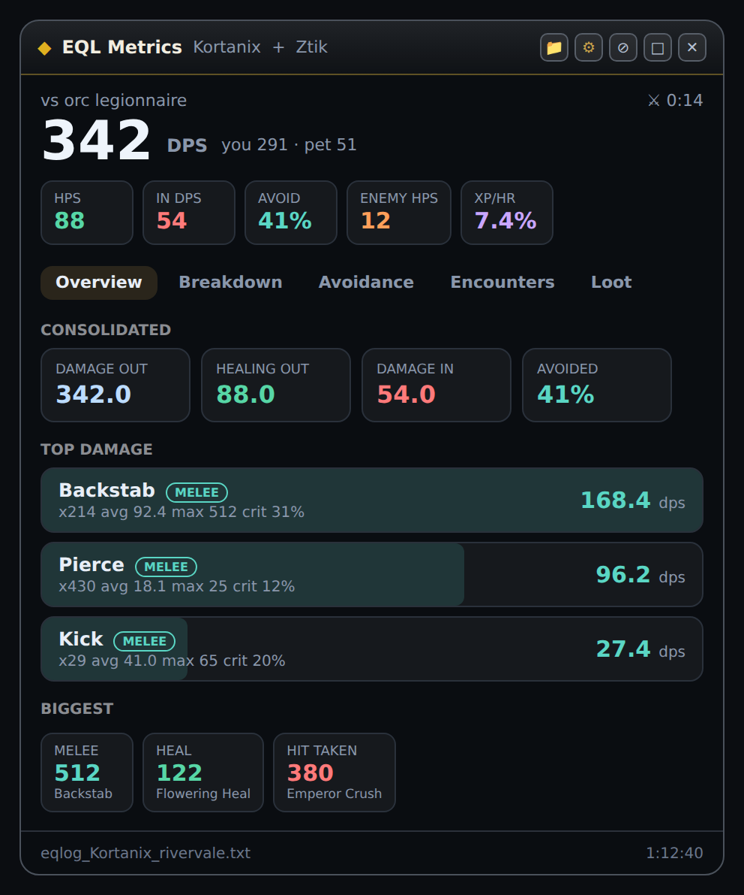
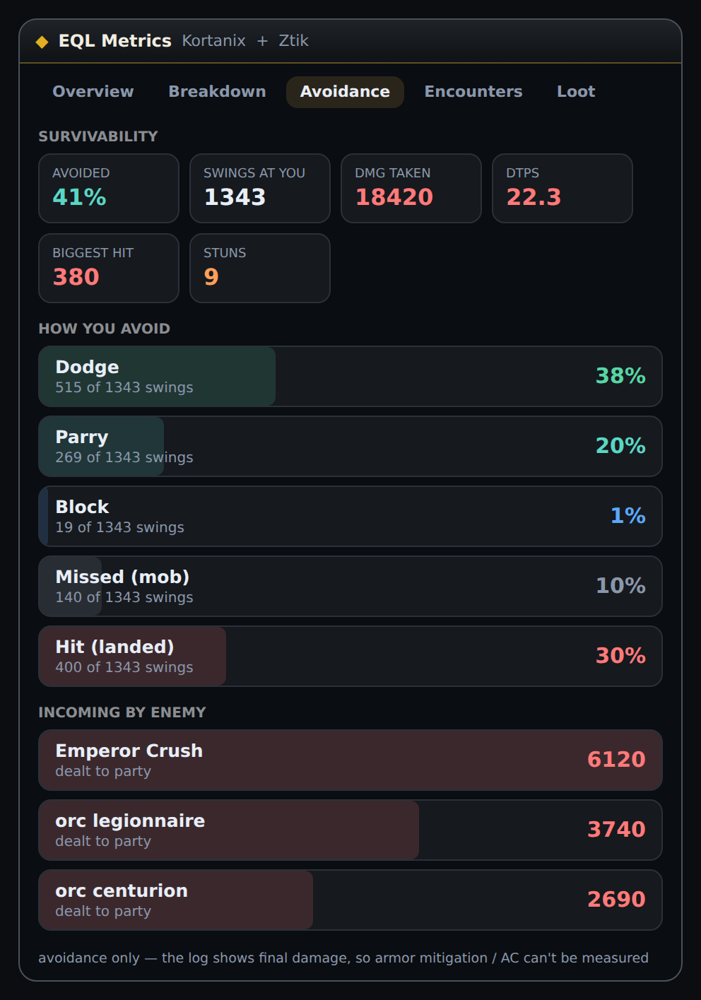
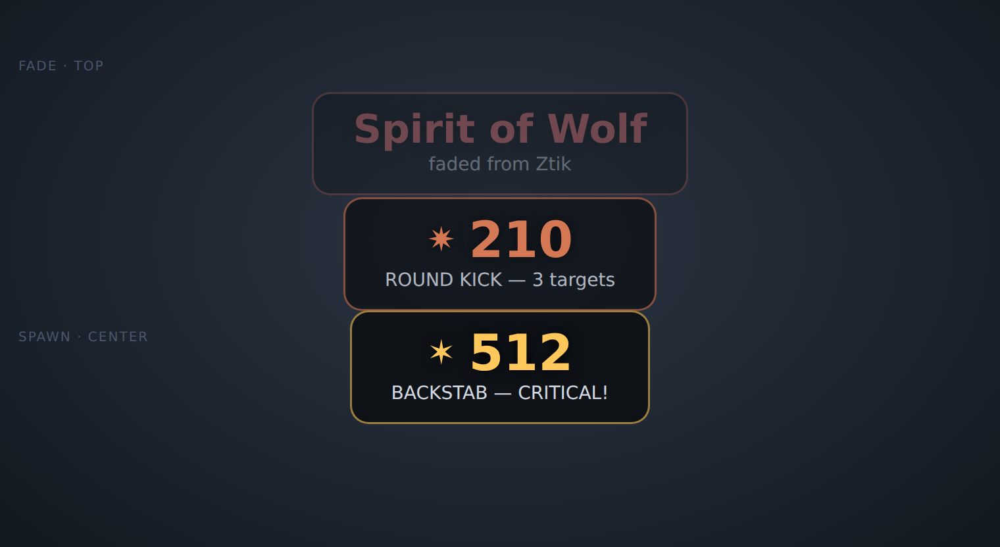
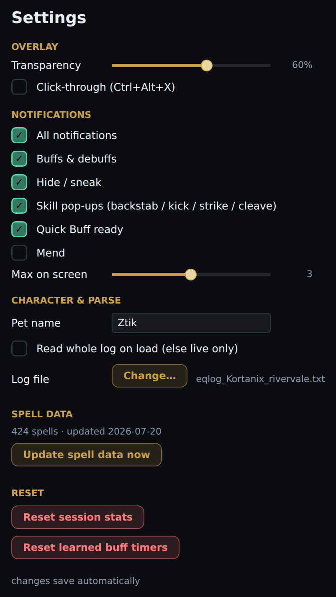
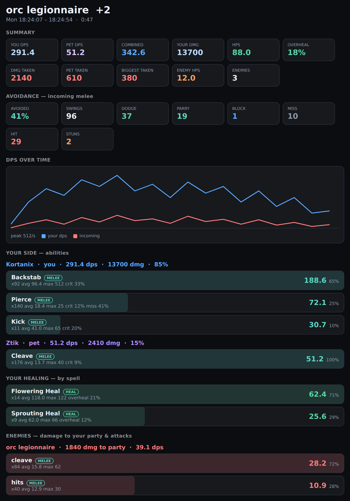

# EQL Metrics

A real-time, movable, transparent combat overlay for **EverQuest Legends**. It tails your
character log and turns it into live DPS/HPS, encounter breakdowns, melee-avoidance stats,
buff/debuff tracking, and big center-screen combat pop-ups — all in a click-through window
that floats over the game and matches the `default_modern` UI theme.

> It reads only your own EverQuest log file (the game's built-in `/log`), the same way parsers
> like ACT and GINA do. Nothing is injected into the game.



---

## Contents

- [Features](#features)
- [Screenshots](#screenshots)
- [Requirements](#requirements)
- [Install & run](#install--run)
- [Using the overlay](#using-the-overlay)
- [Notifications](#notifications)
- [Encounters & the fight pop-out](#encounters--the-fight-pop-out)
- [Avoidance & survivability](#avoidance--survivability)
- [XP & leveling](#xp--leveling)
- [Settings](#settings)
- [Spell data](#spell-data)
- [How it works](#how-it-works)
- [What it can and can't show](#what-it-can-and-cant-show)
- [Extending it](#extending-it)
- [Project layout](#project-layout)

---

## Features

- **Live DPS / HPS** for you and your pet, plus consolidated incoming damage and enemy healing.
- **Encounters** — fights are auto-segmented on a 10-second idle gap, with a rolling history,
  a per-second DPS/incoming timeline, and a detailed pop-out window per fight.
- **Damage breakdown** — per-ability totals, hits, average, max, crit % and miss %.
- **Melee avoidance** — dodge / parry / block / miss rates, damage taken, DTPS, biggest hit,
  stuns, and incoming-by-enemy. (Session and per-encounter.)
- **Buff & debuff tracking** — self-buffs are mapped from their flavor text via the EQL wiki,
  pet buffs and debuffs from their worn-off lines. Alerts on gain and on fade.
- **Center-screen combat pop-ups** that rise and fade — backstab, kick / round kick, strike,
  cleave (with double/triple attack and multi-target detection), hide/sneak success & failure,
  Quick Buff cooldown, Mend, and more.
- **XP & leveling** — live level, % into the current level, **time-to-level** and **kills-to-level**,
  XP/hr, average XP per kill, and a **best-XP-mobs** ranking. Projections self-calibrate off your
  level-ups (no manual setup), and it says so while it waits for the first one.
- **Loot, coin, motes and AA** tracking with per-hour rates.
- **One-click spell-data update** pulled from the EQL wiki (no PowerShell needed).
- **Settings window** to toggle any notification category, set transparency, pet name, and more.
- **Themed** to match the game's `default_modern` skin (charcoal + gold), with your own data palette.

## Screenshots

| Overview (maximized) | Avoidance tab |
| --- | --- |
|  |  |

**Rising combat notifications** — each pops at center, floats up, and fades near the top;
up to three at once.



**Settings window** — opened from the gear icon.



> The images above are representative mockups built from the app's real layout and palette.
> Drop your own screenshots into `images/` to replace them.

## Requirements

- **Windows** (the overlay is WPF / Win32).
- **.NET 10 SDK** — the same one you run `dotnet` with. (No separate runtime install needed
  if you have the SDK.)
- **EverQuest Legends** running in **Windowed** or **Borderless Windowed** mode — an overlay
  can't draw on top of exclusive fullscreen.
- **Logging enabled** in-game: type `/log` once so the client writes `eqlog_<You>_<server>.txt`.

## Install & run

```sh
git clone https://github.com/<you>/eql-metrics.git
cd eql-metrics
dotnet run -c Release
```

Or just **double-click a launcher** (both live in the repo root):

- **`Run-EqlMetrics.cmd`** — builds (incrementally, so it's quick after the first time) and
  starts the overlay. Shows build errors if anything's wrong.
- **`Run-EqlMetrics.vbs`** — the same thing, silent (no console window). Nice as a
  desktop/taskbar shortcut. If it ever seems to do nothing, run the `.cmd` to see why.

Tip: right-click a launcher → **Send to → Desktop (create shortcut)**, then pin it and give it
an icon so it feels like an installed app.

On first launch the overlay tries to auto-detect your newest `eqlog_*.txt`. If it can't, click
the folder icon (or **Settings → Log file → Change…**) and pick it.

## Using the overlay

The window is borderless and always-on-top. Drag the title bar to move it. The top-bar icons:

| Icon | Action |
| --- | --- |
| 📁 | Pick your log file |
| ⚙ | Open **Settings** |
| ⊘ | Toggle **click-through** (also `Ctrl+Alt+X`) |
| ▢ | Expand / collapse (minimized HUD ↔ full tabbed view) |
| ✕ | Close |

**Click-through** makes the overlay ignore the mouse so clicks pass to the game — toggle it back
off (the hotkey works even while click-through is on) when you want to interact with the overlay.

The **minimized HUD** shows the headline DPS, a split for you/pet, and a row of rate chips
(HPS, incoming DPS, avoid %, enemy HPS, XP/hr — with your level and % into it as a subline).
**Expand** for the tabbed view:

- **Overview** — consolidated totals, an **XP & leveling** section (see below), session rates,
  top damage & healing, biggest hits.
- **Breakdown** — party damage and full per-ability breakdowns, healing, incoming.
- **Avoidance** — melee survivability (see below).
- **Encounters** — pick from recent fights, see the DPS timeline, open a detailed pop-out.
- **Loot** — recent drops, coin, and motes.

## Notifications

Combat events surface as center-screen pop-ups that spawn near the middle of the screen, float
upward, and fade out near the top — up to three visible at once (extras queue). They're
click-through and never steal focus from the game.

What flashes, each with its own color and icon:

- **Skills** — backstab / kick / strike hits with the damage, styled gold on a crit; **double**
  and **triple** attacks are merged into one pop-up ("DOUBLE KICK"), and multi-target cleave /
  round-kick shows the target count ("ROUND KICK — 3 targets").
- **Buffs** — green "gained" when a buff lands, red "faded from you/pet" when one drops (a mass
  cast coalesces into one "N buffs gained").
- **Hide / Sneak** — success in violet/teal, failure in red with a ⚠.
- **Quick Buff** — a gold "ready" pop-up when its 10-minute cooldown is up.
- **Mend** — a green confirmation (the log carries no heal amount).

Every category can be toggled in Settings, and the max-on-screen count is adjustable.

## Encounters & the fight pop-out

Fights are segmented automatically: a new encounter starts after a ~10-second lull in combat,
and the last 20 are kept in a rolling history. The **Encounters** tab lets you pick any recent
fight and shows its summary, a DPS/incoming timeline, your party's contribution, healing, and the
enemies — plus a scrollable "recent fights" list. **Click any fight to open its full detail
window.**



The pop-out is a large, review-oriented window that snapshots everything about that one fight:

- **Summary** — your/pet/combined DPS, total damage, HPS and overheal, damage taken, biggest hit,
  enemy healing, and enemy count.
- **Avoidance** — the same melee-avoidance breakdown, scoped to this fight (great for "how did I
  do on that boss?").
- **DPS over time** — a line chart of your outgoing DPS vs. incoming damage, second by second.
- **Your side — abilities** — every party member (you, pet, group) with a full per-ability
  breakdown: hits, average, max, crit % and miss %, and each ability's share of the total.
- **Your healing** — per spell, with overheal.
- **Enemies** — each enemy's damage to your party and its own attack breakdown, plus enemy
  healing if any healed.

Because it's a snapshot taken when you open it, you can leave it up and keep fighting — it won't
change underneath you, so you can review a fight while the next one is already underway.

## Avoidance & survivability

The **Avoidance** tab reconstructs your melee survivability from the log: how often you avoid
incoming swings (dodge / parry / block / mob-miss) versus how often they land, plus damage
taken, DTPS, biggest hit, stuns, and which enemies are hitting you hardest.


> **Honest limit:** the log only records the *final* damage of a hit, never what it would have
> been before armor, so **mitigation / AC can't be measured** — this is avoidance, not defense.
> Likewise there's no HP/mana in the log, so there are no health bars.

## XP & leveling

The **Overview** tab has an **XP & leveling** section that turns your experience messages into a
live picture of how the grind is going. It reads two kinds of log line: each `You gain experience!`
increment, and each `You have gained a level!` ding.

The catch is that the log tells you *how much* XP you just gained, but never *where you are* inside
the current level. So EQL Metrics calibrates itself off your level-ups: the moment it sees a ding it
baselines to 0% and starts the clock, and from then on it knows exactly how far into the level you've
climbed. Until that first ding it shows a **"waiting for a level-up to baseline"** note instead of
guessing — so the projections are honest rather than made up.

Once baselined, the section shows:

- **Level** and **% into level** — your live position in the current level.
- **Time to level** — projected from your XP-per-hour since the last ding.
- **Kills to level** — remaining XP divided by your average XP per kill.
- **XP/hr** and **%/kill** — your rate and how much each kill is worth on average.
- **Best XP mobs** — a ranking of which enemies are giving you the most XP per kill since your last
  level, so you can see what's actually worth killing.

**AA** is kept simple: the SESSION grid tracks AA gained this session and AA/hr (AA rolls in
alongside regular XP, so there's nothing to baseline).

## Settings

The **gear icon** opens a separate Settings window:

- **Overlay** — transparency slider, click-through.
- **Notifications** — a master switch plus per-category toggles (buffs, hide/sneak, skill
  pop-ups, Quick Buff, Mend) and a "max on screen" slider.
- **Character & Parse** — pet name, "read whole log on load", and a log-file picker.
- **Spell data** — current status and a one-click **Update spell data now**.
- **Reset** — clear session stats or learned buff timers.

Everything saves automatically to `%APPDATA%\EqlMetrics\settings.json`.

## Spell data

Self-buff apply/fade text and durations come from the [EQL wiki](https://eqlwiki.com). Click
**Settings → Update spell data now** and the app scrapes the wiki's spell pages directly (in C#,
with a live progress bar) and writes `%APPDATA%\EqlMetrics\spells.json`, which it loads on every
start. Re-run it whenever the game adds or changes spells. All user data — settings, learned buff
timers, and spells — lives in `%APPDATA%\EqlMetrics\`, never in the app folder.

## How it works

EQL Metrics is split in two:

- **`Core/`** — a pure, UI-agnostic parser (`SessionStats` + `CombatAggregate`) that turns log
  lines into combat/session stats and a rolling encounter history. It has no WPF dependency, so
  it can be unit-tested from a plain console harness.
- **The WPF app** — the overlay window, the rising-notification layer, the encounter pop-out,
  and the settings window. It tails the log and feeds each line to the Core parser.

Timing comes from the log's own timestamps, so the same code works live or when replaying an old
log. An external log parser is the *only* way to compute these stats — the game's custom-UI
(EQUI XML) system is declarative and can't read files or do math, which is exactly why parsers
like this exist as standalone tools.

## What it can and can't show

**Can** (it's all in the log): every damage/heal/miss event, avoidance (dodge/parry/block),
stuns, buff/debuff apply & fade, loot/coin/motes/XP/AA, skill activations and their crits,
double/triple attacks, and multi-target splashes.

**Can't** (not in the log): your or the target's **HP/mana** (so no health bars, no "target at
20%", no Mend amount), **armor mitigation / AC**, spell-resist defense, and anything about other
players' buffs or cooldowns. Some same-verb abilities are indistinguishable in text (e.g. Kick /
Round Kick / Flying Kick all log as "kick") except when a multi-target splash reveals them.

---

*EQL Metrics reads your own character log and overlays your own client. It doesn't read or modify
game memory. Play by your server's rules.*
